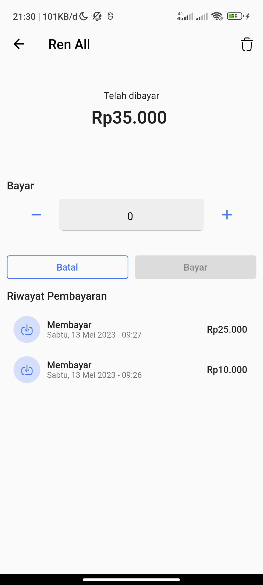

# Kas

## Screenshot
<screenshot style="display: flex;flex-wrap: wrap;">

</screenshot>

Kas adalah sebuah aplikasi yang dibuat untuk membantu dalam mencatat kas, seperti kas kelas. Dengan Kas, dapat dengan mudah mencatat setiap transaksi kas yang terjadi di dalam kelas,

[Download](https://drive.google.com/file/d/1-HjGeIdq1kBkUZkiVifO4HhF4s6mXE9k/view?usp=drivesdk)